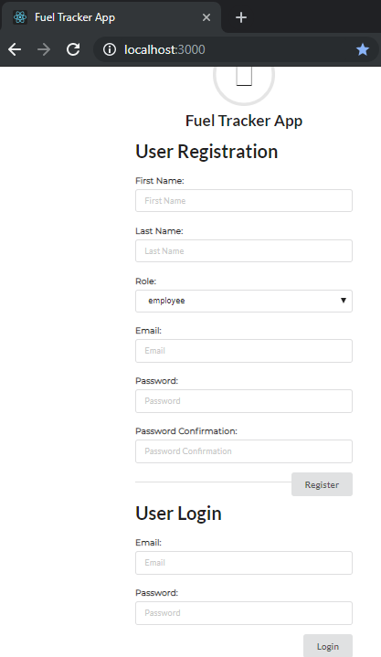

<h1 align="center">
  Fuel Tracker App
</h1>

<h4 align="center">A sample application to meet a technical task.</h4>

<p align="center">
  <a href="#technical-task">Technical Task</a> •
  <a href="#how-to-use">How To Use</a> •
  <a href="#download">Download</a> •
  <a href="#credits">Credits</a> •
  <a href="#development-logbook">Development Logbook</a>
</p>

## Technical Task

To build a Rails App to meet the following user stories:

* User Story - 1
  * As an Employee, I need to be able to enter information into an app when I refuel a vehicle So that my company can keep track of this information.

* Acceptance Criteria:
  * I need to be able to go to the app (url) and enter in the following information about refueling -- Date, Driver, Vehicle, Odometer Reading, Refuel location, litters of Fuel. I need to be able to enter and save this information.

---

* User Story - 2
  * As a manager - with log in credentials, I need to be able to view refuelling information that other people have entered into the system So that I can view and keep track of that infomation.

* Acceptance Criteria:
  * I need to be able to log in with credentials so that I can access the manager section of the system.
  * I need to be able to view refuelling information in the form of a table.
  * I need to be able to log out of the system.

## How to Use

To clone and run this application, you'll need the following installed on your computer:
* [Ruby version: ruby 2.6.3p62 (2019-04-16 revision 67580) x64-mingw32](https://rubyonrails.org/)
* [Git](https://git-scm.com)
* [Node.js](https://nodejs.org/en/download/) (which comes with [npm](http://npmjs.com))

From your command line:

```bash
# Clone this repository
$ git clone https://github.com/mjtabaya/fuel-tracker-app

# Go into the repository
$ cd fuel-tracker-app

# Install dependencies
$ npm install

# Run the app
$ npm start
```

From a second command line:

```bash
# Go into the repository
$ cd fuel-tracker-app

# Migrate and Seed the database
$ rails db:migrate db:seed

# Start Rails API from port 3001
$ rails s -p 3001
```

Open the app on your chosen browser with the following url: http://localhost:3000

<p align="center">
  
</p>


Note: If you're using Linux Bash for Windows, [see this guide](https://www.howtogeek.com/261575/how-to-run-graphical-linux-desktop-applications-from-windows-10s-bash-shell/) or use `node` from the command prompt.

## Download

You can [download](https://github.com/mjtabaya/fuel-tracker-app/archive/master.zip) the latest installable version of Fuel Tracker App for Windows, macOS and Linux.

## Credits

This software uses the following open source packages:

- [Faker](https://github.com/faker-ruby/)
- [Semantic](https://semantic-ui.com/)
- [Node.js](https://nodejs.org/)

## Development Logbook 

https://docs.google.com/spreadsheets/d/1hs8iJfz_pEagrzLUYfqFdCA7fLmpi7Kl0VBIq3hdaPE/edit?usp=drivesdk

## To-do

  * Add specs/tests for react

---

> GitHub [@mjtabaya](https://github.com/mjtabaya)
